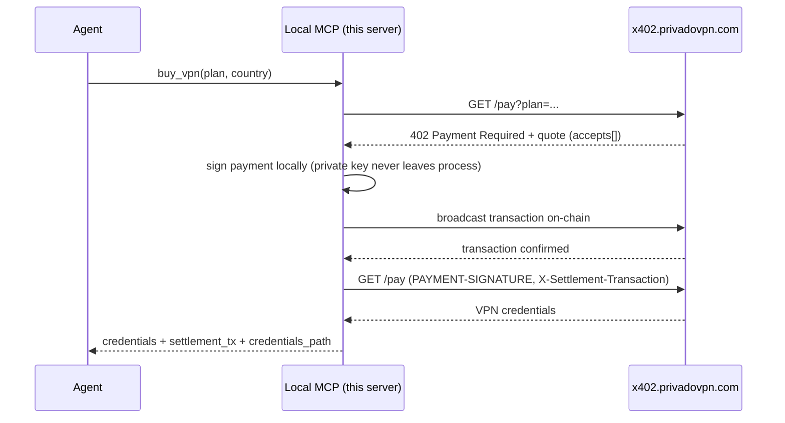

# @privadovpn/x402-mcp

Local stdio MCP server that signs and broadcasts x402 USDC payments (Solana, EVM) to buy PrivadoVPN access.

[](https://www.npmjs.com/package/@privadovpn/x402-mcp)
[](https://github.com/privadovpn/x402-mcp/actions/workflows/ci.yml)
[](LICENSE)
[](https://registry.modelcontextprotocol.io)

## Security model

This server signs payments locally and never transmits your private key anywhere.

- `SOLANA_PRIVATE_KEY` and `EVM_PRIVATE_KEY` are read from local process environment variables. They are used only to sign transactions in-process and are never sent over the network or written to disk by this server.
- The only data that leaves the machine is a signed payment authorization (EVM EIP-3009) or a broadcast transaction signature (Solana), sent to `X402_BASE_URL` to fulfill a purchase.
- Use a dedicated, low-balance wallet for this server — never point it at a primary or high-balance wallet.
- `wallet_status` returns configured addresses and network selection only. It never returns private keys or any secret material.
- Credentials returned after a successful purchase are written only to `~/.privado/` on your local machine.

## Quick start

```bash
npx -y @privadovpn/x402-mcp
```

**Claude Desktop** (`claude_desktop_config.json`):

```json
{
  "mcpServers": {
    "privadovpn-x402-mcp": {
      "command": "npx",
      "args": ["-y", "@privadovpn/x402-mcp"],
      "env": {
        "SOLANA_PRIVATE_KEY": "<your-base58-key>"
      }
    }
  }
}
```

**Claude Code:**

```bash
claude mcp add privadovpn-x402-mcp -e SOLANA_PRIVATE_KEY=<your-base58-key> -- npx -y @privadovpn/x402-mcp
```

**Cursor** (`.cursor/mcp.json`):

```json
{
  "mcpServers": {
    "privadovpn-x402-mcp": {
      "command": "npx",
      "args": ["-y", "@privadovpn/x402-mcp"],
      "env": {
        "SOLANA_PRIVATE_KEY": "<your-base58-key>"
      }
    }
  }
}
```

## Configuration

| Variable | Required | Default | Description |
|----------|----------|---------|--------------|
| `SOLANA_PRIVATE_KEY` | At least one of `SOLANA_PRIVATE_KEY` / `EVM_PRIVATE_KEY` | — | Base58-encoded Solana secret key (32 or 64 bytes) used to sign and pay in SPL USDC. |
| `EVM_PRIVATE_KEY` | At least one of `SOLANA_PRIVATE_KEY` / `EVM_PRIVATE_KEY` | — | Hex-encoded EVM private key used to sign EIP-3009 USDC authorizations. |
| `PREFERRED_NETWORK` | No | `solana` if `SOLANA_PRIVATE_KEY` is set, else `evm` | Which network to prefer when a quote offers both. Accepts `solana` or `evm` (`eip155` is an accepted alias for `evm`). |
| `X402_BASE_URL` | No | `https://x402.privadovpn.com` | Base URL of the x402 payment backend used for catalog, quote, and fulfillment requests. |
| `SOLANA_RPC_URL` | No | `https://api.mainnet-beta.solana.com` | Solana RPC endpoint used to check balances and broadcast transactions. |
| `EVM_RPC_URL` | Required for EVM payments | — | EVM RPC endpoint used to check balances and broadcast transactions. |

## Tools

| Tool | Purpose |
|------|---------|
| `wallet_status` | Show configured wallet addresses and network selection. Never returns private keys. |
| `list_vpn_catalog` | List purchasable VPN plans and supported server country codes. |
| `buy_vpn` | Preferred purchase flow: quote, sign and pay on-chain, fulfill, and save credentials in one call. |
| `fulfill_payment` | Recovery only: exchange an already-broadcast payment for VPN credentials. |
| `sign_and_pay` | Debug only: sign and broadcast payment without fulfilling. Prefer `buy_vpn`. |

## Purchase flow and recovery

Each `GET /pay` request creates a new invoice on the server. Because of this, `buy_vpn` must be called exactly once per purchase attempt — calling it again after funds have already been sent creates a second invoice and results in a duplicate charge.

If `buy_vpn` reports that the on-chain payment succeeded but fulfillment failed (for example, due to a network error when exchanging the payment for credentials), do not call `buy_vpn` again. Instead call `fulfill_payment` with the `plan`, `invoice_no`, `payment_signature`, and `settlement_tx` values from the error. This exchanges the already-completed payment for credentials without creating a new invoice or sending additional funds.

`buy_vpn` and `sign_and_pay` both accept a `dry_run` flag that performs balance checks without broadcasting a transaction. Note that a dry run still creates a real invoice on the server; it does not need to be followed by a real purchase, but it should not be repeated for the same purchase attempt.

## How it works



Supported networks: Solana (SPL USDC transfer) and EVM (EIP-3009 `transferWithAuthorization` USDC).

## Server-side discovery

- Catalog and payment discovery: `https://x402.privadovpn.com/.well-known/x402-payment`
- Agent-readable service description: `https://x402.privadovpn.com/llms.txt`
- Remote MCP (catalog/docs only, no wallet access): `https://x402.privadovpn.com/mcp`

## Development

```bash
git clone git@github.com:privadovpn/x402-mcp.git
cd x402-mcp
npm install
npm run build
npm test
```

Run with the MCP Inspector:

```bash
npx @modelcontextprotocol/inspector node dist/index.js
```

## License

MIT. See [LICENSE](LICENSE).

mcp-name: io.github.privadovpn/x402-mcp
